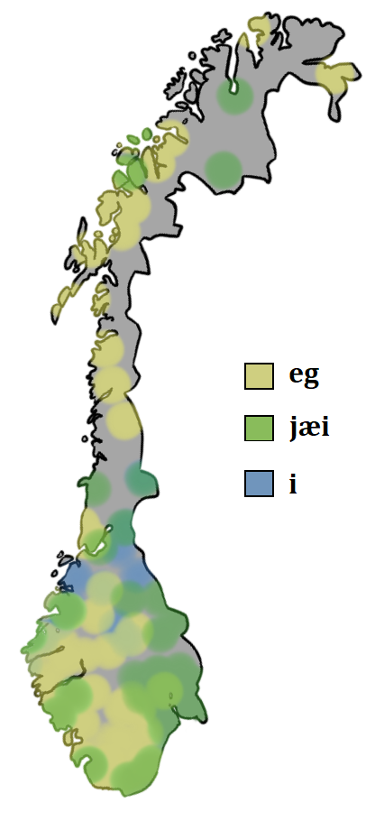

## NorDial

The NorDial project aims to create datasets, resources, and collect knowledge about the state of *written Norwegian dialects* on the web, especially in social media. The project has received 74,140 NOK from Tekst Hub to conduct further annotations.

Norway has a large amount of dialectal variation, as well as a general tolerance to its use in the public sphere. There are, however, few available resources to study this variation and its change over time and in more informal areas, e.g. on social media.

Nordial has already created a [preliminary corpus](./v1.1) of annotated tweets, which we are currently expanding. Furthermore, we are moving beyond classifying tweets, and have begun annotations for word-level dialect features, which should provide a much richer resource for predicting and analyzing dialectal traits used on social media.

**Table of contents:**

1. [Dialects in Norway](#dialects-in-norway)
2. [Version 1.1](#version-1.1)
3. [Resources](#resources)
4. [Project organizers](#project-organizers)
5. [Terms of use](#terms-of-use)

## Dialects in Norway

Norway has a large tolerance towards dialectal variation and, as such, one can find examples of dialectal use in many areas of the public sphere, including politics, news media, and social media.

At the same time, there are two official main writing systems, i.e., Bokmål and Nynorsk, which offer prescriptive rules for how to write the spoken variants. This leads to a situation where people who typically use their dialect when speaking often revert to one of the written standards when writing. However, despite there being only two official writing systems, there is considerable variation within each system, as the result of years of language policies.

However, it is still natural that these standards have a regularizing effect on the written varieties of people who normally speak their dialect in most situations.

In NorDial, we are interested in knowing *to what degree dialect users deviate
from these established norms and use dialect traits when writing informal texts*, e.g. on social media. This could also provide evidence of the vitality of
certain dialectal traits.

We therefore work in two directions simultaneously:
1.  We create datasets of dialectal use on social media which could be of use both to NLP practioners, as well as linguists interested in dialects and social media.
2. We develop state-of-the-art NLP models to detect these tweets automatically, as well as the linguistic features of dialectal tweets.

Finally, we will open source both the data and the models with the hope that they will benefit further research into this intriguing field of research.

## Version 1.1

[This subrepository](./v1.1) contains the data and models described in following paper: [NorDial: A Preliminary Corpus of Written Norwegian Dialect Use](https://aclanthology.org/2021.nodalida-main.51/). Specifically it contains Norwegian tweets labeled as Bokmål, Nynorsk, Dialectal, or Mixed (see paper and further documents in the subrepo for details).

## Project organizers

* Corresponding organizers
    * [Samia Touileb](https://mediafutures.no/2021/01/20/postdoc-samia-touileb/): <Samia.Touileb@uib.no>
    * [Petter Mæhlum](https://www.mn.uio.no/ifi/personer/vit/pettemae/index.html): <pettemae@ifi.uio.no>
    * [Jeremy Barnes](https://jerbarnes.github.io/): <jeremycb@ifi.uio.no>
* Annotators
   * Alexandra Wittemann
   * Marie Emerentze Fleisje
   * Erik Holten

## Terms of use
The data is distributed under a Creative Commons Attribution-NonCommercial licence (CC BY-NC 4.0), access the full license text here: https://creativecommons.org/licenses/by-nc/4.0/

The licence is motivated by the need to block the possibility of third parties redistributing the orignal reviews for commercial purposes. Note that **machine learned models**, extracted **lexicons**, **embeddings**, and similar resources that are created on the basis of the corpus are not considered to contain the original data and so **can be freely used also for commercial purposes** despite the non-commercial condition.
