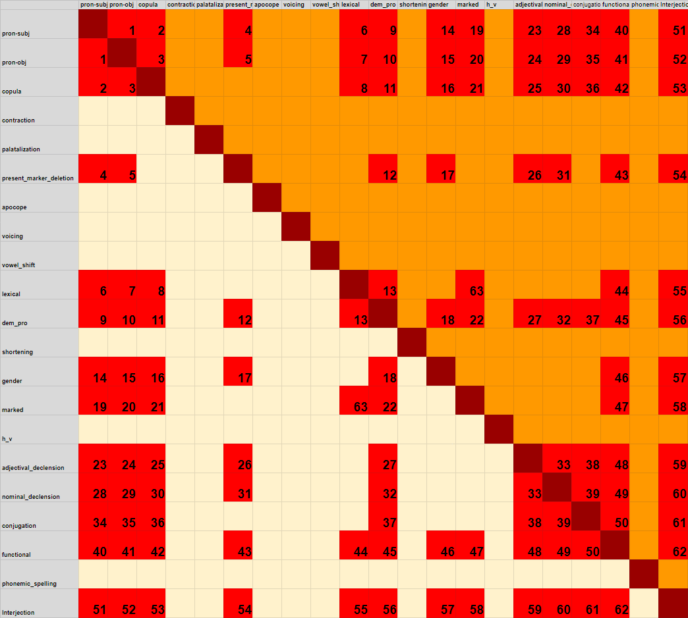

### On the overlap of dialectal labels

*(See overlap.csv and find_overlap.py for machine-readable format and a ready-to-use function)*

Below is a table of labels that cannot overlap. There are other labels that are unlikely to overlap, but they have not been inkluded here. There are also probably tendencies that are unknown to us at the moment. The general overlap restrictions are that some labels are restricted to certain parts of speech. The freest labels are the one containing phonological changes, which can occur in most.

Below the table is a list of reasonings for why the various overlaps cannot happen.

1	A pronoun cannot be both an object and subject at the same time \
2	A subject pronoun cannot also be a copula			 \
3	An object pronoun cannot also be a copula			 \
4	A subject pronoun cannot have a present marker (so it cannot be deleted)			 \
5	An object pronoun cannot have a present marker (so it cannot be deleted)			 \
6	Lexical is for non-functional words whose lemmas are related to normative forms. The pronouns are seen as separate from this.			 \
7	Lexical is for non-functional words whose lemmas are related to normative forms. The pronouns are seen as separate from this.			 \
8	Lexical is for non-functional words whose lemmas are related to normative forms. The copula is separate from this (and is unlikely to have lemmas not from the normative base)			 \
9	It is already known that dem_pro is a pronoun, in a specific function. We do not need to mark them as pronouns.			 \
10	It is already known that dem_pro is a pronoun, in a specific function. We do not need to mark them as pronouns.			 \
11	Dem_pro marks a pronoun, it cannot be the copula			 \
12	Dem pro is a pronoun, they cannot have present markers.			 \
13	Dem pro is for a specific use of pronouns. Pronouns are not in the non-functional category encompassed by "lexical"			 \
14	The "gender" tag is only applicable to nouns and adjectives. Not to pronouns.			 \
15	The "gender" tag is only applicable to nouns and adjectives. Not to pronouns.			 \
16	The "gender" tag is only applicable to nouns and adjectives. Not to copulas			 \
17	The "gender" tag is only applicable to nouns and adjectives. Only verbs can have "present marker"			 \
18	The "gender" tag is only applicable to nouns and adjectives. 			 \
19	The label "marked" is used for normative non-functional words that are stylistically marked. Pronouns are not included here.			 \
20	The label "marked" is used for normative non-functional words that are stylistically marked. Pronouns are not included here.			 \
21	The label "marked" is used for normative non-functional words that are stylistically marked. The copula is not included here.			 \
22	Dem pro is limited to a small class of special words. They are never in the "marked" class.			 \
23	Adjectives cannot be pronouns.			 \
24	Adjectives cannot be pronouns.			 \
25	The copula is not an adjective.			 \
26	Adjectives do not have present markers in Norwegian.			 \
27	Dem pro cannot be an adjective.			 \
28	A pronoun cannot be declined as a noun.			 \
29	A pronoun cannot be declined as a noun.			 \
30	The copula cannot be declined as a noun.			 \
31	Nouns cannot have present tense markers.  \
32	Dem pros are not nouns.  \
33	Adjectives cannot have nominal declensions. \
34	Pronouns are not verbs. \
35	Pronouns are not verbs. \
36	The different forms of the copula are not marked by declension, only productive forms. \
37	Pronouns are not conjugated. \
38	Adjectives are not conjugated. \
39	Nouns are not conjugated. \
40	We do not mark pronouns as functional words \
41	We do not mark pronouns as functional words \
42	We do not mark the copula as a functional word. \
43	Functional words have no present marker. \
44	Functional words cannot be lexical (non-functional out-of-vocabulary). \
45	We do not mark dem_pro as functional words. \
46	Functional words have no grammatical gender. \
47	Functional words cannot be part of the marked category. \
48	Functional words have no adjectival declension \
49	Functional words have no nominal declension \
50	Functional words have no conjugation. \
51	Pronouns cannot be interjections. \
52	Pronouns cannot be interjections. \
53	The copula cannot be an interjection \
54	Interjections cannot have present markers. \
55	The lexical class does not include interjections, it must be either or. \
56	Interjections cannot also be pronouns. \
57	Interjections do not have grammatical gender. \
58	Interjections are separate from the "marked" class. \
59	Interjections cannot have adjectival declensions. \
60	Interjections cannot have nominal declensions. \
61	Interjections cannot be conjugated. \
62	Interjections are not functional words. \
